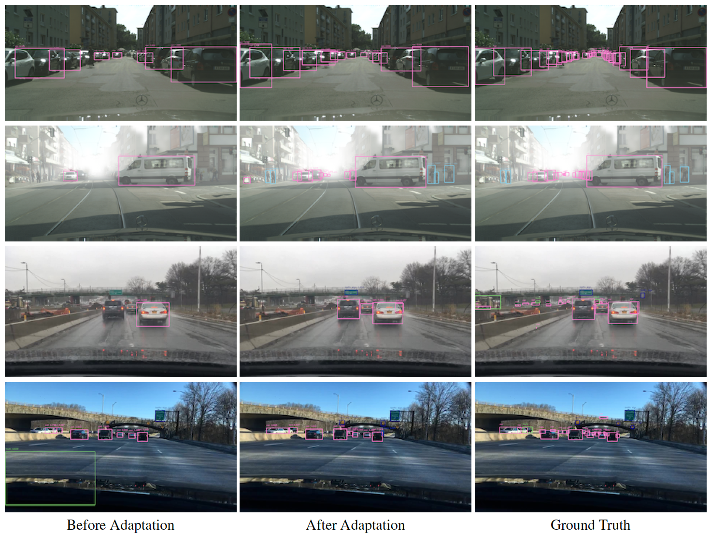
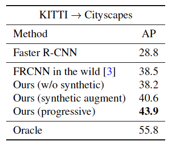
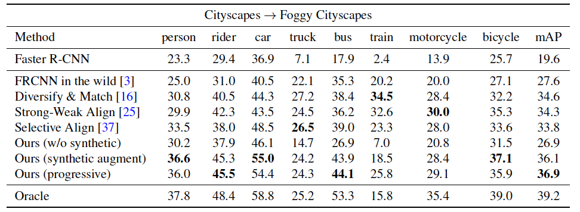
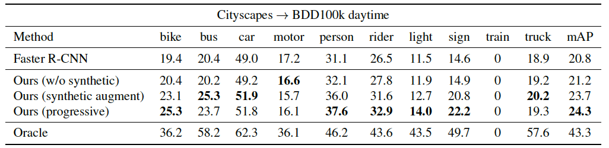

# Progressive Domain Adaptation for Object Detection
Implementation of our paper **[Progressive Domain Adaptation for Object Detection](https://arxiv.org/pdf/1910.11319.pdf)**, based on [pytorch-faster-rcnn](https://github.com/ruotianluo/pytorch-faster-rcnn/blob/master/README.md) and [PyTorch-CycleGAN](https://github.com/aitorzip/PyTorch-CycleGAN).

## Paper
**[Progressive Domain Adaptation for Object Detection](https://arxiv.org/pdf/1910.11319.pdf)**
[Han-Kai Hsu](https://sites.google.com/site/kevinhkhsu/), [Chun-Han Yao](https://www.chhankyao.com/), [Yi-Hsuan Tsai](https://sites.google.com/site/yihsuantsai/home), [Wei-Chih Hung](https://hfslyc.github.io/), [Hung-Yu Tseng](https://sites.google.com/site/hytseng0509/), [Maneesh Singh](https://scholar.google.com/citations?user=hdQhiFgAAAAJ) and [Ming-Hsuan Yang](http://faculty.ucmerced.edu/mhyang/index.html)
IEEE Winter Conference on Applications of Computer Vision (WACV), 2020.

Please cite our paper if you find it useful for your research.
```
@inproceedings{hsu2020progressivedet,
  author = {Han-Kai Hsu and Chun-Han Yao and Yi-Hsuan Tsai and Wei-Chih Hung and Hung-Yu Tseng and Maneesh Singh and Ming-Hsuan Yang},
  booktitle = {IEEE Winter Conference on Applications of Computer Vision (WACV)},
  title = {Progressive Domain Adaptation for Object Detection},
  year = {2020}
}
```

## Dependencies
This code is tested with **Pytorch 0.4.1** and **CUDA 9.0**
```
# Pytorch via pip: Download and install Pytorch 0.4.1 wheel for CUDA 9.0
#                  from https://download.pytorch.org/whl/cu90/torch_stable.html
# Pytorch via conda: 
conda install pytorch=0.4.1 cuda90 -c pytorch
# Other dependencies:
pip install -r requirements.txt
sh ./lib/make.sh
```

## Data Preparation
#### KITTI
- Download the data from [here](http://www.cvlibs.net/datasets/kitti/eval_object.php?obj_benchmark=2d).
- Extract the files under `data/KITTI/`

#### Cityscapes
- Download the data from [here](https://www.cityscapes-dataset.com/).
- Extract the files under `data/CityScapes/`

#### Foggy Cityscapes
- Follow the instructions [here](https://www.cityscapes-dataset.com/) to request for the dataset download.
- Locate the data under `data/CityScapes/leftImg8bit/` as `foggytrain` and `foggyval`.

#### BDD100k
- Download the data from [here](https://bdd-data.berkeley.edu/).
- Extract the files under `data/bdd100k/`

## Generate synthetic data with CycleGAN
Generate the synthetic data with the [PyTorch-CycleGAN](https://github.com/aitorzip/PyTorch-CycleGAN) implementation.

`git clone https://github.com/aitorzip/PyTorch-CycleGAN`

#### Dataset loader code
Import the dataset loader code in `./cycleGAN_dataset_loader/` to train/test the CycleGAN on corresponding image translation task.

#### Generate from pre-trained weight:
Follow the testing instructions on [PyTorch-CycleGAN](https://github.com/aitorzip/PyTorch-CycleGAN) and download the weight below to generate synthetic images. (Remember to change to the corresponding output image size)
- [KITTI with Cityscapes style](http://vllab1.ucmerced.edu/~hhsu22/da_det/pretrained_cycleGAN_weight/K_C_model.tar.gz) (KITTI->Cityscapes): size=(376,1244)
Locate the generated data under `data/KITTI/training/synthCity_image_2/` with same naming and folder structure as original KITTI data.
- [Cityscapes with FoggyCityscapes style](http://vllab1.ucmerced.edu/~hhsu22/da_det/pretrained_cycleGAN_weight/foggyC_C_model.tar.gz) (Cityscapes->FoggyCityscapes): size=(1024,2048)
Locate the generated data under `data/CityScapes/leftImg8bit/synthFoggytrain` with same naming and folder structure as original Cityscapes data.
- [Cityscapes with BDD style](http://vllab1.ucmerced.edu/~hhsu22/da_det/pretrained_cycleGAN_weight/cityscapes_BDDday_model.tar.gz) (Cityscpaes->BDD100k): size=(1024,1280)
Locate the generated data under `data/CityScapes/leftImg8bit/synthBDDdaytrain` and `data/CityScapes/leftImg8bit/synthBDDdayval` with same naming and folder structure as original Cityscapes data.

#### Train your own CycleGAN:
Please follow the training instructions on [PyTorch-CycleGAN](https://github.com/aitorzip/PyTorch-CycleGAN).

## Test the adaptation model
Download the following adapted weights to `./trained_weights/adapt_weight/`
- [KITTI->Cityscapes](http://vllab1.ucmerced.edu/~hhsu22/da_det/adapt_weight/vgg16_faster_rcnn_K2C_stage2.pth)
- [Cityscapes->FoggyCityscapes](http://vllab1.ucmerced.edu/~hhsu22/da_det/adapt_weight/vgg16_faster_rcnn_C2F_stage2.pth)
- [Cityscpaes->BDD100k](http://vllab1.ucmerced.edu/~hhsu22/da_det/adapt_weight/vgg16_faster_rcnn_C2BDD_stage2.pth)
```
./experiments/scripts/test_adapt_faster_rcnn_stage1.sh [GPU_ID] [Adapt_mode] vgg16
# Specify the GPU_ID you want to use
# Adapt_mode selection:
#   'K2C': KITTI->Cityscapes
#   'C2F': Cityscapes->Foggy Cityscapes
#   'C2BDD': Cityscapes->BDD100k_day
# Example:
./experiments/scripts/test_adapt_faster_rcnn_stage2.sh 0 K2C vgg16
```

## Train your own model
#### Stage one
```
./experiments/scripts/train_adapt_faster_rcnn_stage1.sh [GPU_ID] [Adapt_mode] vgg16
# Specify the GPU_ID you want to use
# Adapt_mode selection:
#   'K2C': KITTI->Cityscapes
#   'C2F': Cityscapes->Foggy Cityscapes
#   'C2BDD': Cityscapes->BDD100k_day
# Example:
./experiments/scripts/train_adapt_faster_rcnn_stage1.sh 0 K2C vgg16
```
Download the following pretrained detector weights to `./trained_weights/pretrained_detector/`
- [KITTI for K2C](http://vllab1.ucmerced.edu/~hhsu22/da_det/pretrained_detector/vgg16_faster_rcnn_KITTI_pretrained.pth)
- [Cityscapes for C2f](http://vllab1.ucmerced.edu/~hhsu22/da_det/pretrained_detector/vgg16_faster_rcnn_city_pretrained_8class.pth)
- [Cityscapes for C2BDD](http://vllab1.ucmerced.edu/~hhsu22/da_det/pretrained_detector/vgg16_faster_rcnn_city_pretrained_10class.pth)

#### Stage two
```
./experiments/scripts/train_adapt_faster_rcnn_stage2.sh 0 K2C vgg16
```
Discriminator score files: 
- netD_synthC_score.json
- netD_CsynthFoggyC_score.json
- netD_CsynthBDDday_score.json

Extract the pretrained [CycleGAN discriminator scores](http://vllab1.ucmerced.edu/~hhsu22/da_det/D_score.tar.gz) to `./trained_weights/` </br>
or </br>
Save a dictionary of CycleGAN discriminator scores with image name as key and score as value </br>
Ex: {'jena_000074_000019_leftImg8bit.png': 0.64}

## Detection results


## Adaptation results




## Acknowledgement
Thanks to the awesome implementations from [pytorch-faster-rcnn](https://github.com/ruotianluo/pytorch-faster-rcnn/blob/master/README.md) and [PyTorch-CycleGAN](https://github.com/aitorzip/PyTorch-CycleGAN).
